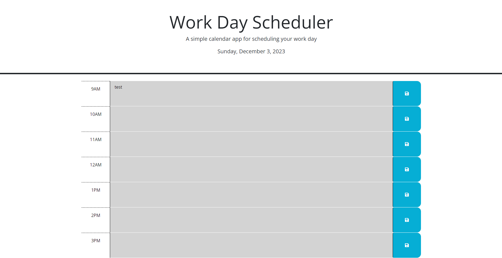

# Work-Day-Scheduler (Module 5 Challenge)

## Description

This Module 5 Challenge was given to me to complete. The goal was to build a daily calender with the typical working hours (9am-5pm) for users to fill out as needed. The calender will reflect the proper date.

## Installation

N/A

## Usage

This page is to act as a simple daily event calender. The page will display the typical working day from 9AM-5PM, the current hour will be displayed in red, the previous hours will be displayed in grey, and the future hours will be displayed in green. There are save buttons along the right side of the time blocks. These can be used after events are added into the time block, the save button will allow the user to store the data on their page (local storage) so their text will persist even if the page is shut or refreshed. 
## Credits

The starter code was provided to me by University of Oregon bootcamp. I also received some assistance from Shelby Hutchinson. 

## Link

## Screenshot

## License

Please refer to the LICENSE in the repository.